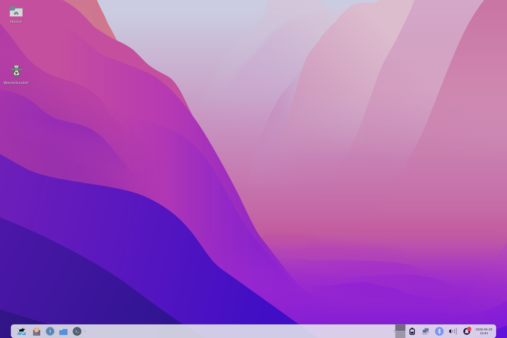
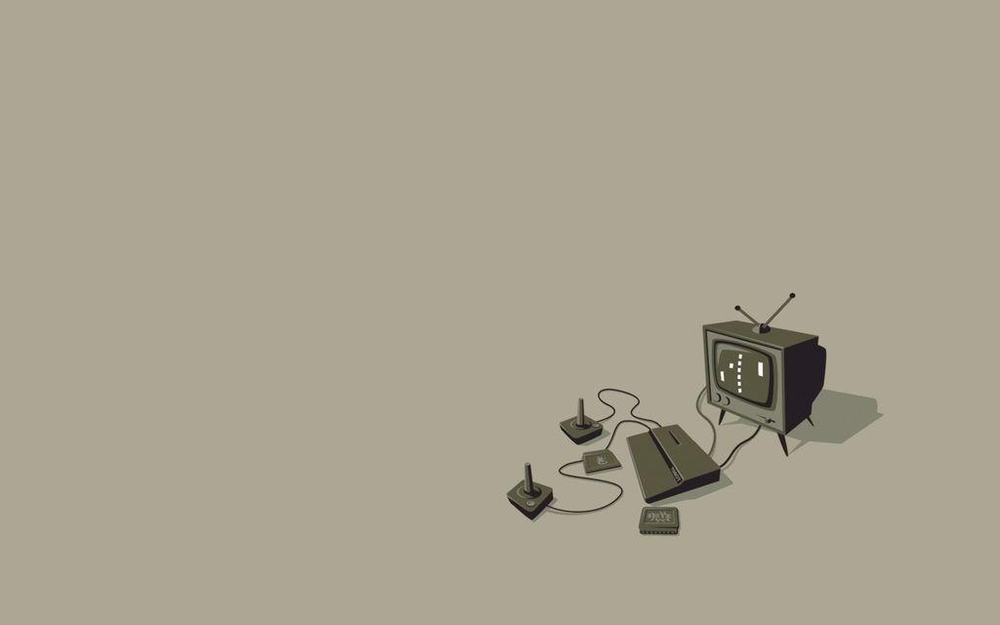
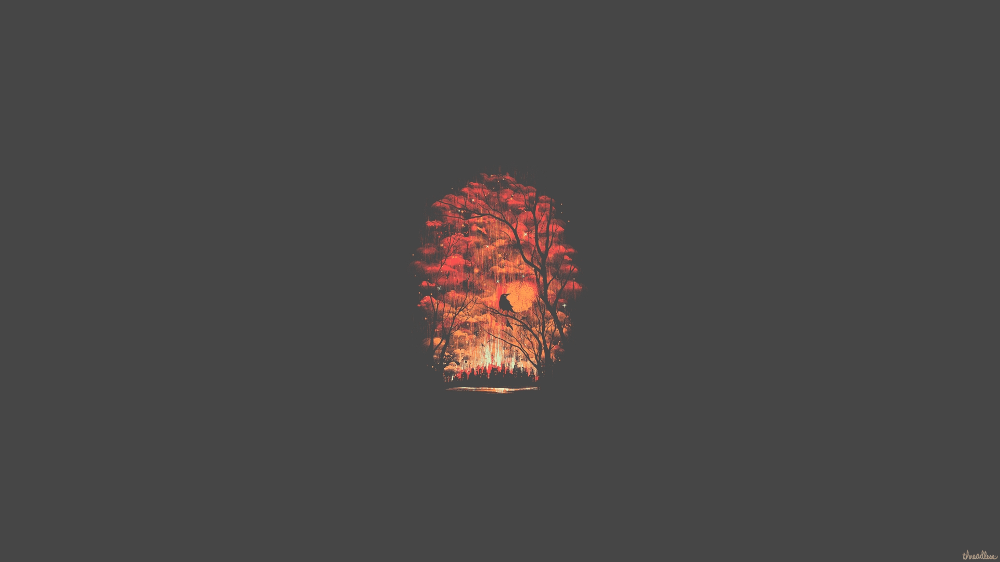

# Minimal-Light — XFCE Theme Setup

A clean, minimal XFCE desktop configuration based on the **Minimal-Light** GTK theme, **Zafiro-Icons-Light** icon pack (with some mod), and a some minimalist wallpapers.



---

## Contents

```
minimal-light/
├── backgrounds/          # 6 minimalist wallpapers
├── config/
│   ├── Thunar/           # Native Thunar configuration
│   └── xfce4/
│       ├── panel/
│       │   └── launcher-*/   # Panel launcher .desktop files
│       └── xfconf/
│           └── xfce-perchannel-xml/   # XFCE channel configuration (XML)
├── themes/
│   └── Minimal-Light/                 # GTK theme
└── install.sh                         # Installation script
```

> The `Zafiro-Icons-Light` icon theme is bundled in the `icons/` folder and installed locally during setup.

---

## Requirements

- XFCE 4.x desktop environment
- Bash shell
- `tar` with xz support
- `curl` (only for remote installation with `--remote`)

---

## XFCE Components & Plugins

### Core XFCE packages

| Package | Description |
|---------|-------------|
| `xfce4` | Base XFCE desktop environment |
| `xfce4-panel` | Panel (required for all plugins below) |
| `xfwm4` | Window manager |
| `xfdesktop` | Desktop manager (wallpaper, icons) |
| `xfce4-settings` | Settings manager and daemon (`xfsettingsd`) |
| `xfce4-session` | Session manager |
| `xfce4-terminal` | Terminal emulator (default in shortcuts) |
| `thunar` | File manager (bound to keyboard shortcut) |

### Panel plugins

| Plugin | Package | Description |
|--------|---------|-------------|
| `whiskermenu` | `xfce4-whiskermenu-plugin` | Application menu (main launcher) |
| `pulseaudio` | `xfce4-pulseaudio-plugin` | Volume control |
| `systray` | built-in | System tray (includes power manager, network, blueman) |
| `notification-plugin` | `xfce4-notifyd` | Notification bell/history |
| `clipman` | `xfce4-clipman-plugin` | Clipboard manager |
| `launcher` | built-in | App shortcut launchers |
| `tasklist` | built-in | Open windows taskbar |
| `pager` | built-in | Workspace switcher (miniature view) |
| `systray` | built-in | System tray |
| `clock` | built-in | Date & time |
| `separator` | built-in | Spacing and separators |

### Optional but referenced

| Tool | Description |
|------|-------------|
| `catfish` | File search (used in Whisker Menu search action) |
| `xflock4` | Screen locker (keyboard shortcut) |
| `xfce4-screenshooter` | Screenshot tool |
| `xfce4-power-manager` | Power management |
| `xfce4-screensaver` | Screensaver |

---

## Installation

### For the current user (local repository)

```bash
bash install.sh
```

### For the current user (remote with curl)

```bash
curl -fsSL https://raw.githubusercontent.com/passy1977/XFCE4-theme-Minimal-Light/main/install.sh | bash -s -- --remote
```

### For a specific user (requires root, local repository)

```bash
sudo bash install.sh --user <username>
```

### For a specific user (requires root, remote with curl)

```bash
curl -fsSL https://raw.githubusercontent.com/passy1977/XFCE4-theme-Minimal-Light/main/install.sh | sudo bash -s -- --remote --user <username>
```

> **Note:** The target user must have logged in at least once before running this command,
> so that their home directory and XFCE profile are properly initialized.

### Options

| Flag | Description |
|------|-------------|
| `--remote` | Download the repository archive before installing; useful with `curl \\| bash` |
| `--user <username>` | Install for a specific user (default: current user) |
| `--help` | Show usage information |

---

## What gets installed

| Component | Destination |
|-----------|-------------|
| GTK theme `Minimal-Light` | `~/.local/share/themes/Minimal-Light` |
| Icon theme `Zafiro-Icons-Light` | Bundled in `icons/` → `~/.local/share/icons/Zafiro-Icons-Light` |
| Wallpapers | `/usr/local/share/backgrounds/` (root) or `~/.local/share/backgrounds/` (user) |
| XFCE config (panel, desktop, keyboard, etc.) | `~/.config/xfce4/xfconf/xfce-perchannel-xml/` |
| Panel launcher shortcuts | `~/.config/xfce4/panel/launcher-*/` |
| Thunar native config (custom actions, shortcuts, bulk renamer) | `~/.config/Thunar/` |

> **Backup**: existing XFCE and Thunar config files are automatically backed up with a `.bak` extension before being replaced.

> **Wallpaper paths**: the script automatically rewrites the wallpaper paths in `xfce4-desktop.xml` to match the actual install destination, whether backgrounds are installed system-wide or in the user's home.

---

## Applying the theme

After installation, log out and log back into your XFCE session to apply all settings.

If some settings are not applied automatically:
- **Settings → Appearance** → select `Minimal-Light`
- **Settings → Icons** → select `Zafiro-Icons-Light`

---

## Included wallpapers

4 minimalist wallpapers are included in the `backgrounds/` folder:  

   
   
   
   
   
   

---

## XFCE configuration files

The following XFCE settings are included:

| File | Description |
|------|-------------|
| `xsettings.xml` | GTK theme, icon theme, cursor |
| `xfce4-desktop.xml` | Wallpaper and desktop layout |
| `xfce4-panel.xml` | Panel layout and plugins |
| `xfwm4.xml` | Window manager settings |
| `xfce4-terminal.xml` | Terminal emulator settings |
| `thunar.xml` | Thunar preferences stored in XFCE channel settings |
| `thunar-volman.xml` | Thunar removable media settings |
| `xfce4-keyboard-shortcuts.xml` | Keyboard shortcuts |
| `xfce4-power-manager.xml` | Power management |
| `xfce4-screensaver.xml` | Screensaver settings |
| `xfce4-notifyd.xml` | Notification daemon settings |
| `keyboards.xml` | Input device configuration |
| `pointers.xml` | Mouse/touchpad settings |

## Thunar configuration files

The following native Thunar files are also included and installed to `~/.config/Thunar/`:

| File | Description |
|------|-------------|
| `accels.scm` | Custom Thunar keyboard accelerators |
| `renamerrc` | Bulk renamer preferences |
| `uca.xml` | User custom actions |

---

## Keyboard Shortcuts

### Applications

| Shortcut | Action |
|----------|--------|
| `Super + Space` | Open Whisker Menu |
| `Super + Return` | Open Terminal |
| `Ctrl + Alt + T` | Open Terminal |
| `Ctrl + Alt + F` | Open File Manager (Thunar) |
| `Super + E` | Open File Manager (Thunar) |
| `Alt + F2` | App Finder (collapsed) |
| `Super + R` | App Finder |
| `Super + P` | Display Settings |
| `Ctrl + Alt + L` | Lock Screen |
| `Ctrl + Alt + Delete` | Session Logout |
| `Ctrl + Escape` | Desktop right-click menu |
| `Alt + F1` | Applications Menu |
| `XF86PowerOff` | Session Logout (`xfce4-session-logout`) |
| `XF86WWW` / `HomePage` | Open default Web Browser |
| `XF86Mail` | Open default Mail Reader |
| `Search` | Open Catfish file search |
| `Tools` / `AudioMedia` | Open Amazon Music (web) |

### Screenshots

| Shortcut | Action |
|----------|--------|
| `Print` | Screenshot (full screen) |
| `Alt + Print` | Screenshot (active window) |
| `Shift + Print` | Screenshot (region select) |

### Window Management (xfwm4)

| Shortcut | Action |
|----------|--------|
| `Alt + F4` | Close window |
| `Alt + Tab` | Cycle windows |
| `Alt + Shift + Tab` | Cycle windows (reverse) |
| `Super + Tab` | Switch window |
| `Super + Up` | Maximize window |
| `Super + Down` | Shade/unshade window |
| `Super + Delete` | Hide window |
| `Super + D` | Show desktop |
| `Super + Page Up` | Move window (keyboard) |
| `Super + Page Down` | Resize window (keyboard) |
| `Alt + Space` | Window menu |
| `Alt + F6` | Toggle sticky (all workspaces) |

### Window Tiling

| Shortcut | Action |
|----------|--------|
| `Super + KP_Left` | Tile left |
| `Super + KP_Right` | Tile right |
| `Super + KP_Up` | Tile up |
| `Super + KP_Down` | Tile down |
| `Super + KP_Home` | Tile top-left |
| `Super + KP_End` | Tile bottom-left |
| `Super + KP_Page Up` | Tile top-right |
| `Super + KP_Next` | Tile bottom-right |

### Window → Monitor

| Shortcut | Action |
|----------|--------|
| `Super + Left` | Move window to left monitor |
| `Super + Right` | Move window to right monitor |

### Workspaces

| Shortcut | Action |
|----------|--------|
| `Ctrl + Alt + Left` | Move window to previous workspace |
| `Ctrl + Alt + Right` | Move window to next workspace |
| `Ctrl + Alt + Up` | Go to workspace above |
| `Ctrl + Alt + Down` | Go to workspace below |
| `Ctrl + F1` … `Ctrl + F12` | Switch to workspace 1–12 |
| `Ctrl + Alt + KP_1` … `KP_9` | Move window to workspace 1–9 |

Shortcuts for moving a window left, right, or up within the current workspace are intentionally left unbound in the shipped profile.

---

## Credits

- **Zafiro Icons** by [zayronxio](https://github.com/zayronxio/Zafiro-icons/) — icon theme used in this setup, licensed under GPL-3.0.
  Bundled as `icons/Zafiro-Icons-Light.tar.xz` (from [xfce-look.org](https://www.xfce-look.org/s/xfce/p/1209330/)).
- Background images were downloaded from various sources on the internet.
